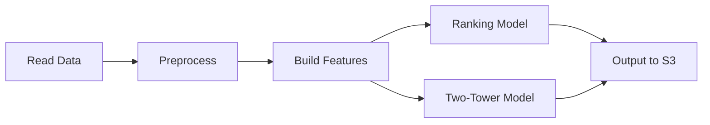

# ETL Pipeline for Recommendation System

End-to-End ETL (Extract, Transform, Load) pipeline for building recommendation system features.

## 📁 Project Structure

```
ETL/
├── pipeline/
│   ├── __init__.py
│   └── pipeline.py              # Main orchestrator
│
├── readers/
│   ├── __init__.py
│   └── s3_reader.py             # Read from S3
│
├── writers/
│   ├── __init__.py
│   └── s3_writer.py             # Write to S3
│
├── transformation/
│   ├── __init__.py
│   ├── pre_process.py           # Data cleaning & preprocessing
│   ├── features.py              # Feature engineering (customer, item, temporal)
│   ├── joins.py                 # Join operations
│   ├── ranking_features.py      # Ranking model features
│   └── two_tower_features.py    # Two-tower model features
│
├── utils/
│   ├── __init__.py
│   └── spark_session.py         # Spark configuration
│
├── tests/
│   ├── __init__.py
│   └── test_etl_pipeline.py     # Unit and integration tests
│
├── logs.py                      # Logging configuration
├── CONFIG.md                    # Detailed configuration guide
├── requirements.txt             # Python dependencies
└── README.md                    # This file
```

## 🚀 Quick Start

### Installation

```bash
# Create virtual environment
python -m venv venv
source venv/bin/activate  # Windows: venv\Scripts\activate

# Install dependencies
pip install -r requirements.txt
pip install pytest
```

### Configuration

Set AWS credentials:
```bash
aws configure
```

Update S3 paths in:
- `readers/s3_reader.py` - Source data paths
- `writers/s3_writer.py` - Output paths
- `transformation/*.py` - Output paths for features

### Run Pipeline

**Test mode (sample data):**
```bash
python ETL/pipeline/pipeline.py --mode test
```

**Production mode (full data):**
```bash
python ETL/pipeline/pipeline.py --mode prod
```

## 📊 Pipeline Overview



### Step 1: Read Data
- Reads articles, customers, and transactions from S3
- Validates data is not empty
- Logs record counts and column names

### Step 2: Preprocess Data
- Convert timestamps to proper format
- Remove duplicates
- Handle missing values:
  - Numeric: Fill with median
  - String: Fill with 'unknown' or defaults
- Normalize string columns (lowercase, trim)
- Filter invalid records (negative prices, null IDs)
- Validate data quality

### Step 3: Feature Engineering

#### Ranking Model Features
**User Aggregations:**
- `purchase_count`: Total purchases per customer
- `avg_spend`: Average spend per transaction
- `favorite_category`: Most purchased category

**Item Aggregations:**
- `item_purchase_count`: Total times item was bought
- `unique_buyers`: Number of unique customers
- `avg_item_price`: Average item price

**Temporal:**
- `day_of_week`: 1-7 (Sunday-Saturday)
- `month`: 1-12
- `is_weekend`: Binary flag

**Interaction:**
- `price_affinity`: Distance between user avg price and item price
- `popularity_price_score`: Item popularity × item price
- `days_since_last_purchase`: Recency

#### Two-Tower Model Features
**User Tower:**
- `purchase_count`, `avg_spend`, `favorite_category`
- `category_interaction_count`, `favorite_color`, `color_interaction_count`

**Item Tower:**
- `item_purchase_count`, `unique_buyers`, `avg_item_price`

## 🧪 Testing

Run all tests:
```bash
pytest ETL/tests/test_etl_pipeline.py -v
```

Run specific test class:
```bash
pytest ETL/tests/test_etl_pipeline.py::TestPreprocessing -v
```

Run with coverage:
```bash
pytest ETL/tests/test_etl_pipeline.py --cov=ETL --cov-report=html
```

### Test Coverage

✅ **Data Quality Tests**
- Non-negative prices
- No null IDs
- No duplicate transactions
- Required columns present

✅ **Preprocessing Tests**
- Data loading
- Column validation
- Temporal conversion
- Null value handling

✅ **Feature Engineering Tests**
- Customer aggregations
- Item aggregations
- Temporal features
- Cross-features
- Category/color affinity

✅ **Integration Tests**
- Full pipeline flow
- Feature completeness
- Output validation

## 📝 Logging

All pipeline steps produce detailed logs:

```
================================================================================
ETL PIPELINE INITIALIZED
Mode: TEST
================================================================================

[SETUP] Initializing Spark session and components...
✓ Spark session created

================================================================================
STEP 1: READING RAW DATA FROM S3
================================================================================

✓ Articles loaded successfully. Records: 10000
✓ Customers loaded successfully. Records: 5000
✓ Transactions loaded successfully. Records: 50000
```

Logs include:
- ✓ Successful operations
- ⚠ Warnings
- ✗ Errors with details
- Duration of each step
- Data validation results

## 🔧 Key Components

### DataReader (`readers/s3_reader.py`)
```python
from readers.s3_reader import DataReader

reader = DataReader(test=True)
articles, customers, transactions = reader.read_all(spark)
```

### DataWriter (`writers/s3_writer.py`)
```python
from writers.s3_writer import DataWriter

writer = DataWriter(test=True)
writer.write_features(df, feature_type="ranking", name="features")
```

### Preprocessing (`transformation/pre_process.py`)
```python
from transformation.pre_process import preprocess

customers, articles, transactions = preprocess(
    customers, articles, transactions, test=True
)
```

### Feature Building
```python
from transformation.ranking_features import build_ranking_features
from transformation.two_tower_features import build_two_tower_features

ranking_df = build_ranking_features(transactions, customers, articles)
two_tower_df = build_two_tower_features(transactions, customers, articles)
```

## 🎯 Main Pipeline Usage

```python
from pipeline.pipeline import ETLPipeline

# Create pipeline
pipeline = ETLPipeline(test=True)

# Run full pipeline
pipeline.run()
```

Or from command line:
```bash
python ETL/pipeline/pipeline.py --mode test
```

## 📊 Output Structure

Features are written to S3:

**Test Mode:**
- `s3://recommendation-system-1149/features/sample/ranking_model/`
- `s3://recommendation-system-1149/features/sample/two_tower_model/`

**Production Mode:**
- `s3://recommendation-system-1149/features/main/ranking_model/`
- `s3://recommendation-system-1149/features/main/two_tower_model/`

## ⚙️ Configuration Options

**Spark Session** (`utils/spark_session.py`):
- Shuffle partitions: 200
- Timezone: UTC
- Parquet output type: TIMESTAMP_MICROS

**S3 Paths** (in `readers/s3_reader.py`):
- Test: `s3://recommendation-system-1149/raw-data/sample_data`
- Production: `s3://recommendation-system-1149/raw-data/main_data`

## 🐛 Troubleshooting

### Issue: S3 Access Error
```
An error occurred (NoCredentialsError)
```
**Solution:** Configure AWS credentials
```bash
aws configure
```

### Issue: Out of Memory
```
java.lang.OutOfMemoryError
```
**Solution:** Increase Spark memory in `utils/spark_session.py`
```python
.config("spark.driver.memory", "4g")
.config("spark.executor.memory", "4g")
```

### Issue: Path Not Found
```
Path does not exist
```
**Solution:** Verify S3 paths and that data exists

## 📋 Dependencies

Key dependencies (see `requirements.txt` for full list):
- pyspark==3.5.1
- pandas==1.5.3
- numpy==1.24.4
- boto3==1.29.7 (AWS)
- pytest==7.x.x (testing)

## 📚 Additional Documentation

- `CONFIG.md` - Detailed configuration and feature descriptions
- `logs.py` - Logging configuration
- Test file - `tests/test_etl_pipeline.py` - 50+ test cases

## 🤝 Contributing

When adding new features:
1. Add comprehensive logging
2. Include proper error handling
3. Write unit tests
4. Update this README

## 📞 Support

For issues or questions:
1. Check logs first
2. Review `CONFIG.md`
3. Run test suite: `pytest tests/test_etl_pipeline.py -v`
4. Check error handling section in `CONFIG.md`

---

**Last Updated:** January 2025
**Version:** 1.0.0
**Status:** Production Ready
